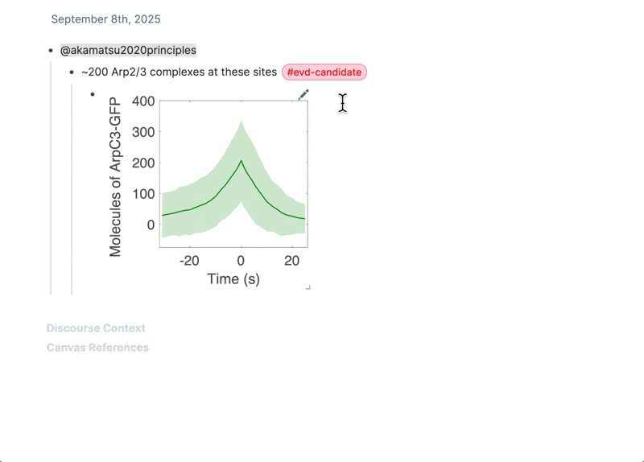

# Tagging Candidate Nodes

## Purpose - mark a potential item for later

While you're taking notes, often you'll recognize a potential item to revisit later. Like: "might be evidence?"

It's helpful to quickly tag these. Later, you can search for them and formalize them in one click.

## Setup - define candidate nodes

In the discourse graphs settings, for each node type, list a "candidate node" tag label:

> ⚠️ Important: A tag cannot use text that is already part of its associated node's format. For example, if the "Claim" node format is CLM, you cannot use #CLM as its tag. You'll get an error message if you attempt to do this.

## Tag candidate nodes

Tag candidate nodes with the keyboard shortcut: ` \ `

Click or use the down arrow key to select a candidate node type.

> 💡 If you've customized the keyboard shortcut for creating nodes, this keyboard shortcut will change too

## Formalize candidate nodes

Hover your mouse over the node tag, and click "Create Evidence"

<!-- TODO: update this gif with smoother UX, including auto-remove tag -->

## Candidate node styling

Candidate node styling is currently controlled in roam/css. You can borrow our node styling here: [template-lab CSS page](https://roamresearch.com/#/app/template-lab/page/X8V4gy32s)

