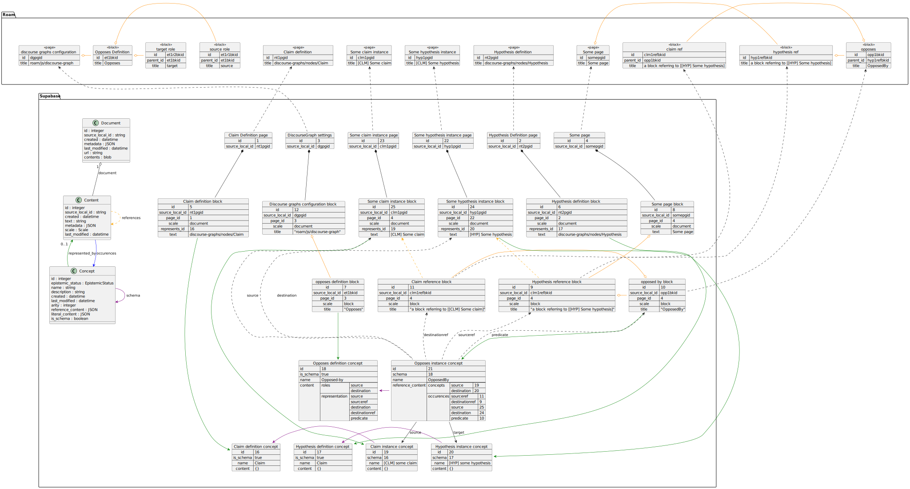

# example...

Content:

* (nt1pgid) discourse-graphs/nodes/Claim
* (nt2pgid) discourse-graphs/nodes/Hypothesis
* (dgpgid) roam/js/discourse-graph
  * (et1bkid) Opposes
      * (et1r1bkid) source
      * (et1r2bkid) destination
    * (anyid1) If
      * (et1sr1bkid) Page
      * (et1sr2bkid) Block
      * (et1sr3bkid) ParentPage
      * (et1sr4bkid) PBlock
      * (et1sr5bkid) SPage
      * (et1sr6bkid) SBlock
* (hyp1pgid) [HYP] Some hypothesis
* (clm1pgid) [CLM] Some claim
* (somepgid) Some page
  * (hyp1refbkid) a block referring to [[HYP] Some hypothesis]
    * (opp1bkid) OpposedBy
      * (clm1refbkid) a block referring to [[CLM] Some Claim]

Documents:

| id | source_local_id |
|----|-----------------|
| 1  | nt1pgid         |
| 2  | nt2pgid         |
| 3  | dgpgid         |
| 22 | hyp1pgid        |
| 23 | clm1pgid        |
| 4  | somepgid        |

Content:

| id | source_local_id | page_id | scale    | represents_id | text                                         |
|----|-------------|-------------|----------|---------------|----------------------------------------------|
| 5  | nt1pgid         | 1       | document | 16            | discourse-graphs/nodes/Claim                 |
| 6  | nt2pgid         | 2       | document | 17            | discourse-graphs/nodes/Hypothesis            |
| 12 | dgpgid          | 3       | document |               | roam/js/discourse-graph                      |
| 7  | et1bkid         | 3       | block    | 18            | Opposes                                      |
| 13 | et1r1bkid       | 3       | block    |               | source                                       |
| 14 | et1r2bkid       | 3       | block    |               | destination                                  |
| 8  | somepgid        | 4       | document |               | Some page                                    |
| 24 | hyp1pgid        | 22      | document | 20            | [HYP] Some hypothesis                        |
| 25 | clm1pgid        | 23      | document | 19            | [HYP] Some claim                             |
| 9  | hyp1refbkid     | 4       | block    |               | a block referring to [[HYP] Some hypothesis] |
| 10 | opp1bkid        | 4       | block    | 21            | OpposedBy                                    |
| 11 | clm1refbkid     | 4       | block    |               | a block referring to [[CLM] Some claim]      |

Concept:

| id | is_schema | arity | schema | name                  | content   |
|----|-----------|-------|--------|-----------------------|-----------|
| 16 | true      | 0     |        | Claim                 | {}        |
| 17 | true      | 0     |        | Hypothesis            | {}        |
| 18 | true      | 2     |        | Opposed-by            | { "roles": ["source", "destination"], "representation": ["source", "sourceref", "destination", "destinationref", "predicate"] } |
| 19 | false     | 0     | 16     | [CLM] Some claim      | {}        |
| 20 | false     | 0     | 17     | [HYP] Some hypothesis | {}        |
| 21 | false     | 2     | 18     | OpposedBy             | { "concepts": {"source": 19, "destination": 20}, "occurences": [{"sourceref": 11, "destinationref": 9, "source": 25, "destination": 24, "predicate": 10 }] } |

Note: Open question whether the occurence structure matters, and whether it should be materialized in another table.
(I would tend to say yes to both.)

ContentLink

| source | destination |
|--------|-------------|
| 9      | 24          |
| 11     | 25          |

Note: I would probably create a sub-Content for the link text and use this as source.
OR use a char_start, char_end.

Missing: Ontology

This is what the rows would look like in diagram form:

